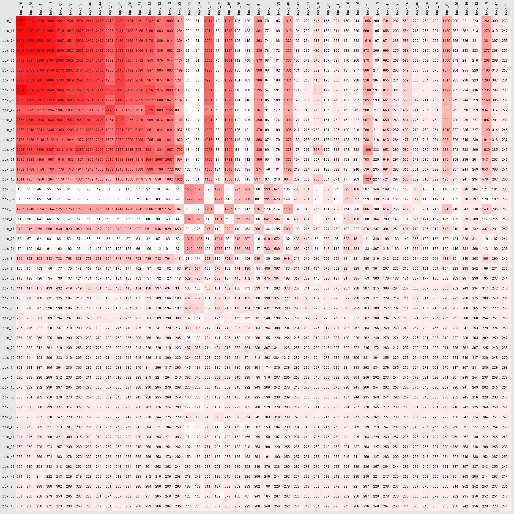

# Heatmap painer

> **Heatmap** - table that has all cell painted to some gradient color depending on value in such cell

There are several kinds of these maps for different purposes. 
This one is for mapping two sets of data with known attitude coefficients.

#### Example: 

